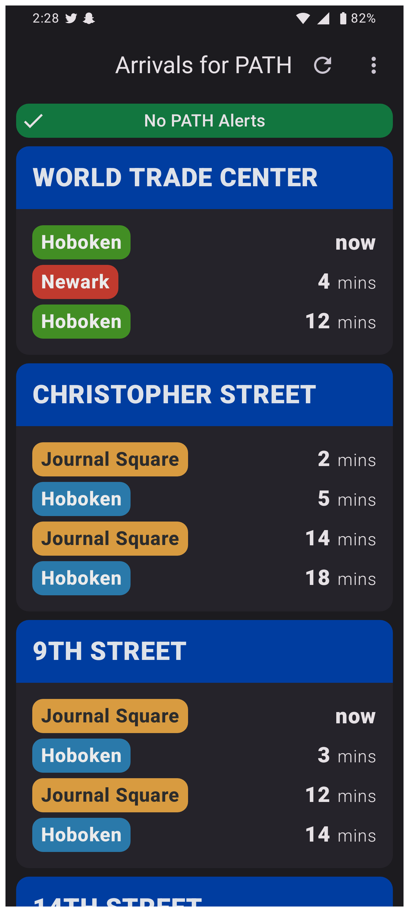
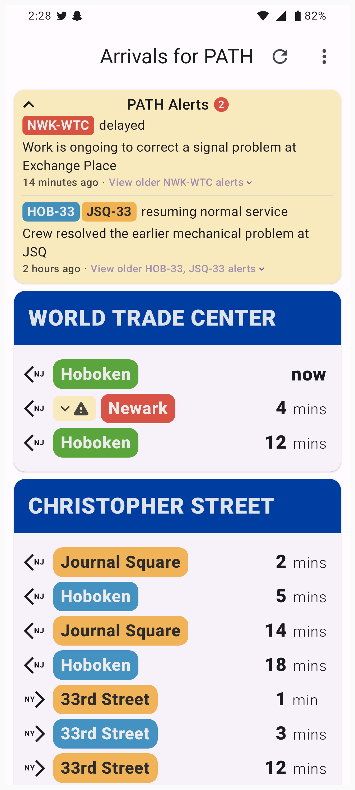

 &nbsp;&nbsp;
 &nbsp;

# Arrivals for PATH
An Android app for riding [the PATH](https://en.wikipedia.org/wiki/PATH_(rail_system)) that shows the next arrivals for trains at every station.

Some features of the app:
* Modern design, more visually pleasing than the official app.
* Real-time display of upcoming trains at every PATH station.
* Utilizes authentic color-coding and styling, mirroring PATH signage and train visuals for a familiar experience to both new and seasoned commuters.
* Arranges listings based on proximity, eliminating the need for scrolling.
* Optional filtering to exclusively view trains bound for NYC when in NJ, or vice versa, so you only see the trains you actually care about.
* Flexibility in display naming, from concise "WTC" to expanded "World Trade Center," accommodating varied levels of local familiarity.
* Functioning countdowns during WiFi/data signal loss, referencing the most recent data.
* Presents comprehensive PATH alerts, intelligently grouped to provide an up-to-date status overview for each incident and train line.
* Show PATH alerts specific to each line when seeing a train's ETA, so you know right away if your train is delayed.

## Development

Built with:
* 100% Kotlin
* UI in 100% [Jetpack Compose](https://developer.android.com/jetpack/compose)
* [Kotlin Flow](https://kotlinlang.org/docs/flow.html)
* [Android ViewModels](https://developer.android.com/topic/libraries/architecture/viewmodel)

## Screenshots
 
